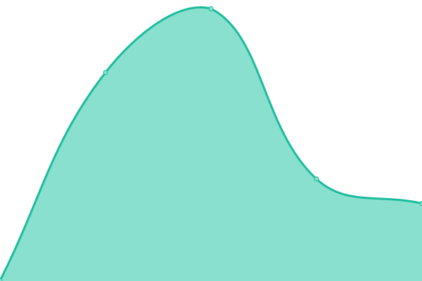

# [📈 Live Status](https://Tomvivi.github.io/upptime): <!--live status--> **🟩 All systems operational**

This repository contains the open-source uptime monitor and status page for [Tomvivi](https://Tomvivi.github.io/upptime), powered by [Upptime](https://github.com/upptime/upptime).

With [Upptime](https://upptime.js.org), you can get your own unlimited and free uptime monitor and status page, powered entirely by a GitHub repository. We use [Issues](https://github.com/Tomvivi/upptime/issues) as incident reports, [Actions](https://github.com/Tomvivi/upptime/actions) as uptime monitors, and [Pages](https://Tomvivi.github.io/upptime) for the status page.

<!--start: status pages-->
<!-- This summary is generated by Upptime (https://github.com/upptime/upptime) -->
<!-- Do not edit this manually, your changes will be overwritten -->
<!-- prettier-ignore -->
| URL | Status | History | Response Time | Uptime |
| --- | ------ | ------- | ------------- | ------ |
|  [dpln-guidesDOTcom](https://dpln-guides.com/) | 🟩 Up | [dpln-guides-do-tcom.yml](https://github.com/Tomvivi/upptime/commits/HEAD/history/dpln-guides-do-tcom.yml) | 

 691ms
     
 | 

<a href="https://tomvivi.github.io/upptime/history/dpln-guides-do-tcom">48.71%</a>
    

|  [wh1503126](https://wh1503126.ispot.cc/fr/mmorpg/actualites/news/anomalie-89441/inscrip.php) | 🟩 Up | [wh1503126.yml](https://github.com/Tomvivi/upptime/commits/HEAD/history/wh1503126.yml) | 

 236ms
     
 | 

<a href="https://tomvivi.github.io/upptime/history/wh1503126">85.72%</a>
    

<!--end: status pages-->

[**Visit our status website →**](https://Tomvivi.github.io/upptime)

## 📄 License

- Powered by: [Upptime](https://github.com/upptime/upptime)
- Code: [MIT](./LICENSE) © [Anand Chowdhary](https://anandchowdhary.com), supported by [Pabio](https://pabio.com)
- Data in the `./history` directory: [Open Database License](https://opendatacommons.org/licenses/odbl/1-0/)
